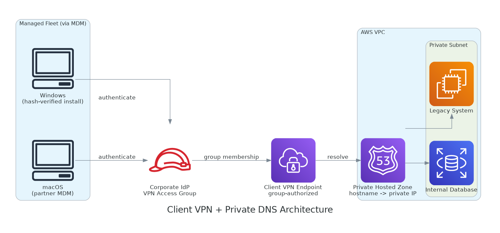

# AWS Client VPN Deployment

An enterprise rollout of AWS Client VPN to a mixed Windows and macOS fleet, with automated client deployment via MDM, private DNS resolution for internal AWS resources, and identity-based access control through the corporate directory.

---

## Overview

This project documents the deployment of AWS Client VPN as the controlled access path into a private AWS network, replacing ad-hoc public exposure of internal resources. The rollout covered automated client installation across 30+ Windows machines and a fleet of Macs, integration with the corporate identity provider for access control, and private DNS so that VPN-connected users resolve internal endpoints to private IPs.

The VPN became the backbone for a broader security programme: once it was reliable, public access to internal databases and legacy systems could be removed, with the VPN as the sole remaining path in.

---

## Architecture

| Layer | Component |
|---|---|
| Tunnel | AWS Client VPN endpoint, certificate + federated auth |
| Identity | Corporate IdP group governs who may connect |
| DNS | Private hosted zone resolves internal hostnames to private IPs |
| Client (Windows) | AWS VPN Client deployed and configured via MDM |
| Client (macOS) | Same client, distributed through the Mac MDM channel |

---

## Identity-Based Access Control

Access is gated by membership of a directory security group, not by handing out a shared profile. Only members of the VPN access group are authorised on the endpoint, so granting or revoking access is a directory operation, not a certificate reissue.

```bash
# Authorize a specific IdP group on the VPN endpoint (not all-users)
aws ec2 authorize-client-vpn-ingress \
  --client-vpn-endpoint-id <endpoint-id> \
  --target-network-cidr 0.0.0.0/0 \
  --access-group-id <idp-group-id> \
  --authorize-all-groups false
```

A deliberate sequencing note: the broad all-users authorization rule is only removed after the specific group rule is confirmed working and all required users are in the group, so nobody is locked out mid-cutover.

---

## Private DNS Resolution

A VPN tunnel alone is not enough: connected machines must resolve internal hostnames to private IPs, otherwise they still try to reach resources over the public internet. A private hosted zone provides that resolution for VPN-connected clients.

```bash
# A record mapping an internal hostname to its private IP
aws route53 change-resource-record-sets \
  --hosted-zone-id <private-zone-id> \
  --change-batch '{
    "Changes": [{
      "Action": "UPSERT",
      "ResourceRecordSet": {
        "Name": "<internal-hostname>",
        "Type": "A",
        "TTL": 60,
        "ResourceRecords": [{"Value": "<private-ip>"}]
      }
    }]
  }'
```

For targeted cases, a per-machine hosts-file entry was used to force a single hostname down the VPN path without changing public DNS prematurely, useful during phased per-user migrations.

---

## Automated Client Deployment

Rather than walking every user through a manual install, the client was packaged into a deployment script pushed through MDM. The script verifies the installer against a known SHA256 hash before installing, so a tampered or corrupted download is rejected.

```powershell
# Windows deployment (abridged): verify hash, then install silently
$expectedHash = "<sha256-of-approved-installer>"
$actualHash = (Get-FileHash $installerPath -Algorithm SHA256).Hash
if ($actualHash -ne $expectedHash) {
    Write-Error "Installer hash mismatch - aborting"
    exit 1
}
Start-Process -FilePath $installerPath -ArgumentList "/quiet" -Wait
# ...then drop the managed connection profile into place
```

### Mixed-Fleet Reality

A practical lesson: not all devices are managed from the same place. Windows machines received the script from the corporate MDM directly, but the Macs were enrolled in a partner-managed MDM tenant and had to be distributed through that channel instead. Identifying which devices reported to which tenant was a prerequisite to a clean rollout, the kind of detail that determines whether an enterprise deployment actually reaches everyone.

---

## Rollout Approach

1. Finalise and hash-pin both client scripts (Windows and macOS)
2. Pilot on a small set of physical machines, one per OS
3. Push to the full Windows fleet via MDM
4. Hand the macOS package to the partner MDM channel for distribution
5. Build a directory group for users who should *not* have VPN access, to make the access boundary explicit
6. Broadcast a connectivity test and track confirmations before removing any legacy access path

---

## Repository Structure

```
aws-vpn-deployment/
├── README.md
├── docs/
│   ├── diagrams/
│   │   └── vpn-architecture.png
│   ├── rollout-plan.md
│   └── private-dns-design.md
├── scripts/
│   ├── deploy-vpn-windows.ps1
│   ├── deploy-vpn-mac.sh
│   └── verify-connectivity.ps1
└── change-records/
    ├── CR-vpn-endpoint-setup.md
    ├── CR-private-hosted-zone.md
    └── CR-access-group-enforcement.md
```

---

## Tech Stack

- AWS Client VPN, Route 53 (private hosted zone), VPC
- Corporate IdP / directory groups for access control
- MDM (Windows and macOS client distribution)
- PowerShell, Bash

> All endpoint IDs, hostnames, IP addresses, group IDs, hashes, and tenant identifiers have been sanitized. This documents the deployment approach, not any specific environment's configuration.

---

## Architecture Diagram


